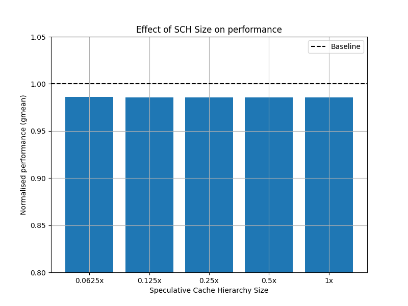
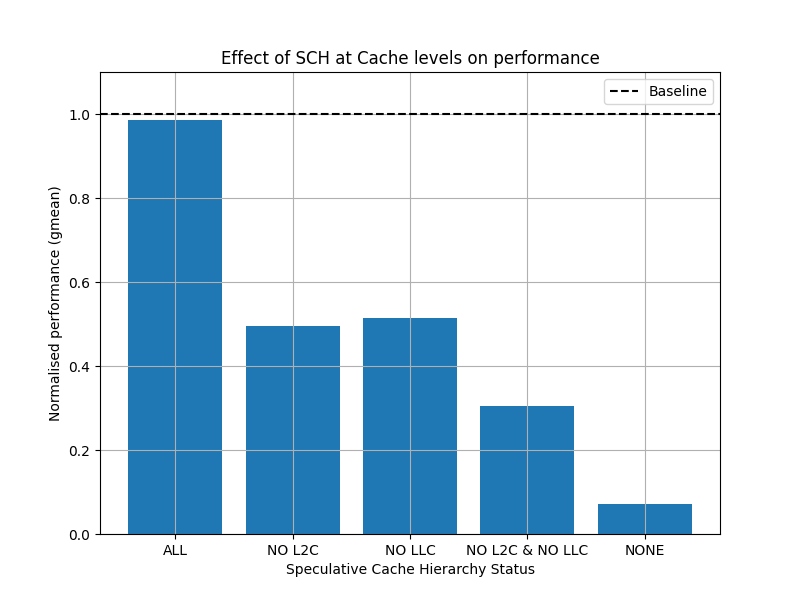

# Speculative-Cache-Hierarchy

Extension of GhostMinion (https://dl.acm.org/doi/10.1145/3466752.3480074) for core with large size ROBs

## Testing

1. Add traces to `traces/` folder (`.gitkeep` has been added as placeholder)

2. Run the following commands to simulate the traces on different models

```bash
# Simulation with 1M Instructions
bash list_data.sh  # Setup Input
python run_all.py all_traces.txt  # Will run all SPEC17 & ClientServer traces
```

```bash
# Data Analysis
bash list_data.sh  # Setup input
python extract.py results_1M_list.txt  # Extract results from ChampSim output
python summarize.py extracted_results.csv  # Summarize results for each trace
```

3. Summary of results will be stored in `summary/` folder (uploaded to https://docs.google.com/spreadsheets/d/1FTAI6n2S5PncKy_ky9HtW7kDRofKTGrvTM61a7VmJno/edit?usp=sharing)

- `all_spec_diff_size.csv` contains results for different sizes of speculative cache considering all instructions as speculative
- `all_spec_diff_setup.csv` contains results for different models of speculative cache considering all instructions as speculative

## Results

1-1.5% performance slowdown

### Inferences

1. Changing the size of Speculative Cache has no visible effect on performance

2. Removing Speculative Caches at any cache level without compromising on security has a drastic effect on performance

### Plots



